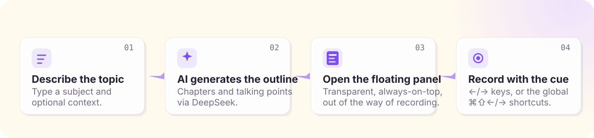

<p align="center">
  
</p>

# DemoCue

[中文](#中文) | [English](#english)

## 中文

DemoCue 是面向视频创作者的 macOS 桌面助手：用 AI 生成讲解提纲，录制时通过透明置顶浮窗展示章节和讲解重点。录教程、产品演示、技术分享时，让表达始终有结构。

### 下载

最新版本：[Releases](https://github.com/my19940202/record-float-bar/releases/latest)

> ⚠️ 当前 DMG 未做 Apple 签名和公证，首次打开前需要执行：
>
> ```bash
> xattr -dr com.apple.quarantine /Applications/DemoCue.app
> ```

首次使用前，在应用「设置」页配置 DeepSeek API Endpoint 和 API Key。

### 它是怎么工作的

<p align="center">
  
</p>

1. **描述录制主题**——输入主题和补充说明，比如「录一个 10 分钟的技术分享」
2. **AI 生成提纲**——DeepSeek 生成章节和讲解重点，本地保存、随时编辑
3. **打开悬浮窗**——透明置顶、毛玻璃质感，不遮挡录制内容
4. **跟着提示录制**——按 `←` / `→` 或全局快捷键 `⌘⇧←` / `⌘⇧→` 切换章节，要点悬浮在眼前

### 功能

- AI 生成结构化讲解提纲（DeepSeek 官方 API）
- 提纲本地保存、浏览和编辑
- 透明置顶毛玻璃悬浮窗：主题、布局、字号、透明度、模糊度、背景色均可调
- 章节快捷切换：面板内 `←` / `→` 键 + 全局快捷键
- 中文 / English 界面切换


### 开发

```bash
pnpm install
pnpm tauri dev
```

### 构建

```bash
pnpm tauri build
```

### 技术栈

Tauri 2 / Rust · React 19 / TypeScript / Vite · Tailwind CSS · SQLite

### 限制

- 目前仅支持 macOS
- 需要自备 DeepSeek API Key

## English

DemoCue is a desktop companion for video creators on macOS. It generates recording outlines with AI and shows chapters plus talking points in a transparent always-on-top floating window while you record — so demos, tutorials, and talks stay structured.

### Download

Latest release: [Releases](https://github.com/my19940202/record-float-bar/releases/latest)

> ⚠️ The current DMG is not Apple signed or notarized. Before opening the app for the first time, run:
>
> ```bash
> xattr -dr com.apple.quarantine /Applications/DemoCue.app
> ```

Before first use, configure the DeepSeek API Endpoint and API Key in the Settings page.

### How it works

<p align="center">
  
</p>

1. **Describe the topic** — type a subject and optional context, e.g. "a 10-minute technical talk"
2. **AI generates the outline** — DeepSeek produces chapters and talking points, saved and editable locally
3. **Open the floating panel** — transparent, always-on-top, frosted glass, never in the way of recording
4. **Record with the cue** — switch chapters with `←` / `→` or the global `⌘⇧←` / `⌘⇧→` shortcuts, talking points float right beside your screen

### Features

- Generate structured recording outlines with the official DeepSeek API
- Save, browse, and edit outlines locally
- Transparent always-on-top floating panel with theme, layout, font size, opacity, blur, and background options
- Quick chapter switching: in-panel `←` / `→` keys plus global shortcuts
- Chinese / English UI

### Development

```bash
pnpm install
pnpm tauri dev
```

### Build

```bash
pnpm tauri build
```

### Tech Stack

Tauri 2 / Rust · React 19 / TypeScript / Vite · Tailwind CSS · SQLite

### Limitations

- macOS only for now
- Requires your own DeepSeek API key
